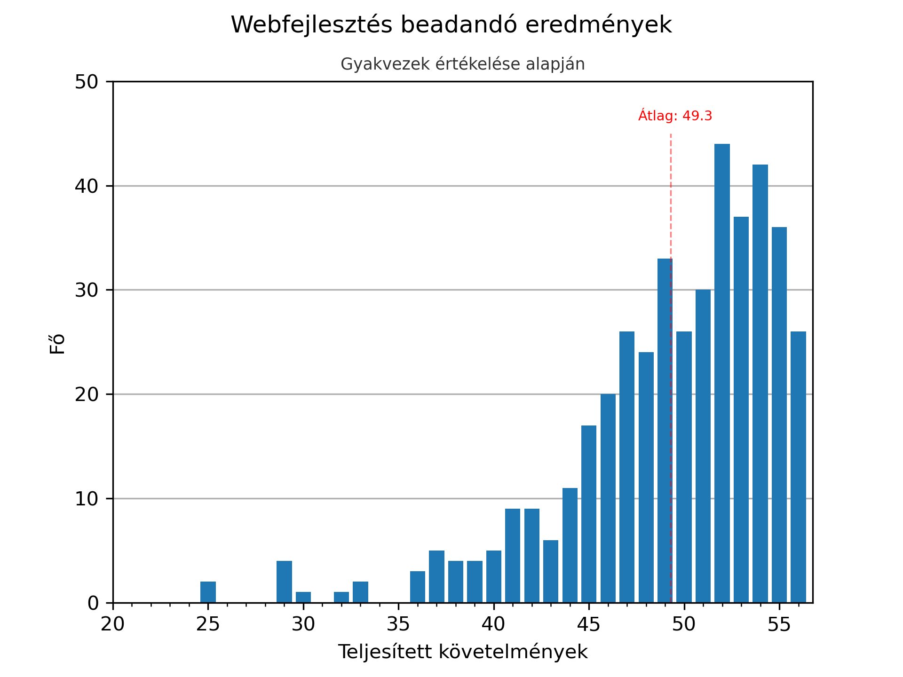
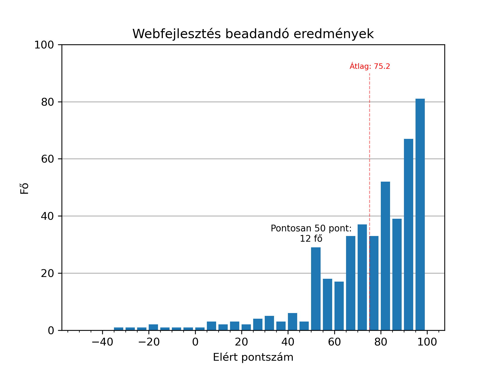
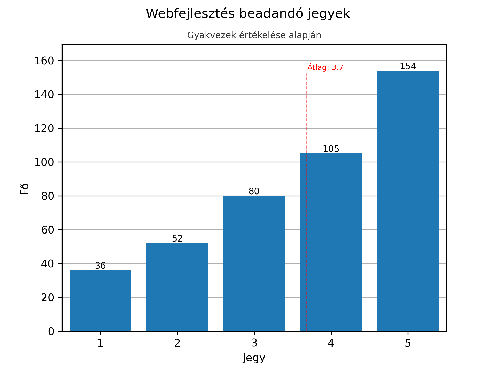
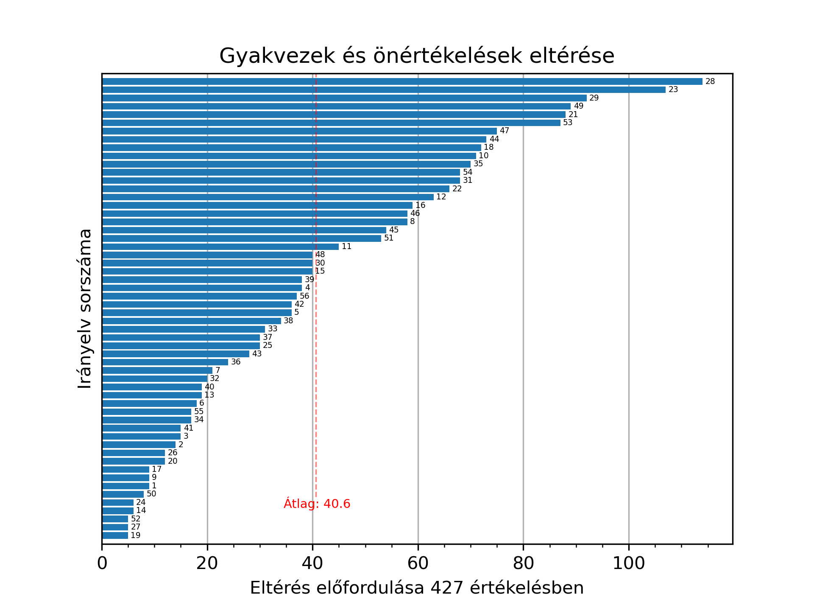

# Statisztikagyűjtő alkalmazás az ELTE WEb-fejlesztés (IP-18WF1EG) tárgyának a beadandójához

## Bevezetés

A tárgy beadandója egy saját weboldal, amit különböző szempontok szerint értékel a gyakorlatvezető és két társértékelő. Az értékelések [ezen az oldalon](http://webfejlesztes.inf.elte.hu/tarsertekeles) tekinthetőek meg egy társértékelési kóddal. Az értékeléseknél azt is látjuk, hogy mi a minket értékelő társértékelők társértékelési kódja, amikkel aztán az ő táblázataikat is meg lehet nézni, és így tovább.

*⚠ Update: Sajnos most már captcha szükséges az értékelések megtekintéséhez, így ez a script nem tudja automatikusan letölteni a weboldalakat, és értelmét vesztette.*

## Scriptek

### 1. [`scrape_codes.py`](./scrape_codes.py)

Ez felelős az összes társértékelő kód összegyűjtéséért. Ezeket 3 különböző módon menti el:

1. Egyszerű listában ([codes.txt](./codes.txt))
2. Minden kódhoz az általa értékelt oldalak kódja ([forward_codes.json](./forward_codes.json))
3. Minden kódhoz az őt értékelők kódjai ([backward_codes.json](./backward_codes.json))

### 2. [`download_ratings.py`](./download_ratings.py)

*Előfeltétele a `codes.txt` létezése (ld. `scrape_codes.py`)*

Letölti az összes értékelő táblázatot tartalmazó oldalt a `ertekelesek/{kod}.html` fájlokba.

### 3. [`download_sites.py`](./download_sites.py)

*Előfeltétele a `codes.txt` létezése (ld. `scrape_codes.py`) és a `wget` létezése `$PATH`-ban*

Letölt minden weboldalt. Nem ajánlott lefuttatni, 400+ darab, egyesével akár 100mb+-os oldalt tölt le.

### 4. [`webdev_parser.py`](./webdev_parser.py)

*Előfeltétele az `ertekelesek` mappa létezése (ld. `download_ratings.py`) és a `bs4`*

Az egyetlten érdekes fájl. Kinyer minden adatot az értékelések html fájljaiból és elmenti a `crit_sites.pickle` fájlba. Ebben van minden class (`Criterion`, `Rating`, `Site`) definiálva és nagyon szépen(?) dokumentálva.

### 5. [`stats.py`](./stats.py)

*Előfeltétele a `crit_sites.pickle` fájl létezése (ld. `webdev_parser.py`) és a `matplotlib`*

Ez gyártja a grafikonokat és egyéb statisztikákat.

## Eredmények

A grafikonok nem éppen a legszebbek, de az információt átadják..

```txt
36 oldal bukott biztosan - 8.43%

26 oldal tökéletes a gyakvezek értékelése szerint: y6cf, wxu3, 3h9c, 49dt, 6tp9...

Akik csak egy követelményt nem teljesítettek a gyakvez szerint, azok a(z) 45. követelményt hibázták el a leggyakrabban (5/36): Alternatív, nagybetűs, nagy kontrasztú stílus változat elérhető a gyengénlátó felhasználók számára minden oldalon.

Gyakvezek értékelése szerint a(z) 45. követelményt hibázták el a leggyakrabban (48%): Alternatív, nagybetűs, nagy kontrasztú stílus változat elérhetõ a gyengénlátó felhasználók számára minden oldalon.

A gyakvezek és a társértékelők pontozása a leggyakrabban (130/415) a(z) 10. követelménynél tért el: Az elkészült weblap reszponzív.
```

### Teljesített követelmények száma



### Pontszámok

50 ponttól kettes.  


### Jegyek



### Gyakori eltérések gyakvezek és társértékelők értékelési között

28\.: Nincsenek helyesírási hibák, elgépelések  
23\.: Az űrlap szövegmezõi a várt adatnak megfelelõ hosszúságúak  
29\.: A letapogathatóság elve alapján a kulcsszavak ki vannak emelve (félkövér, dőlt), ahol az értelmes, felsoroláslista lett használva


